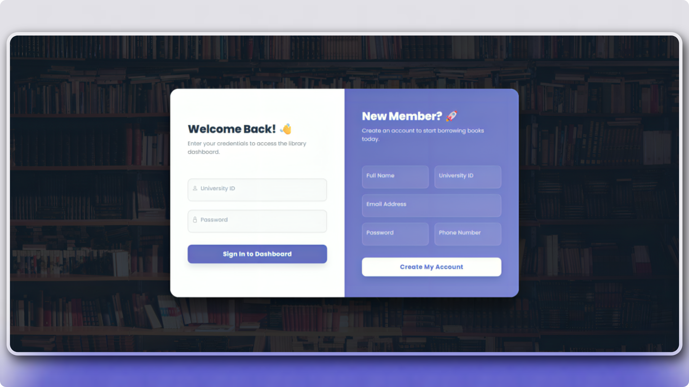
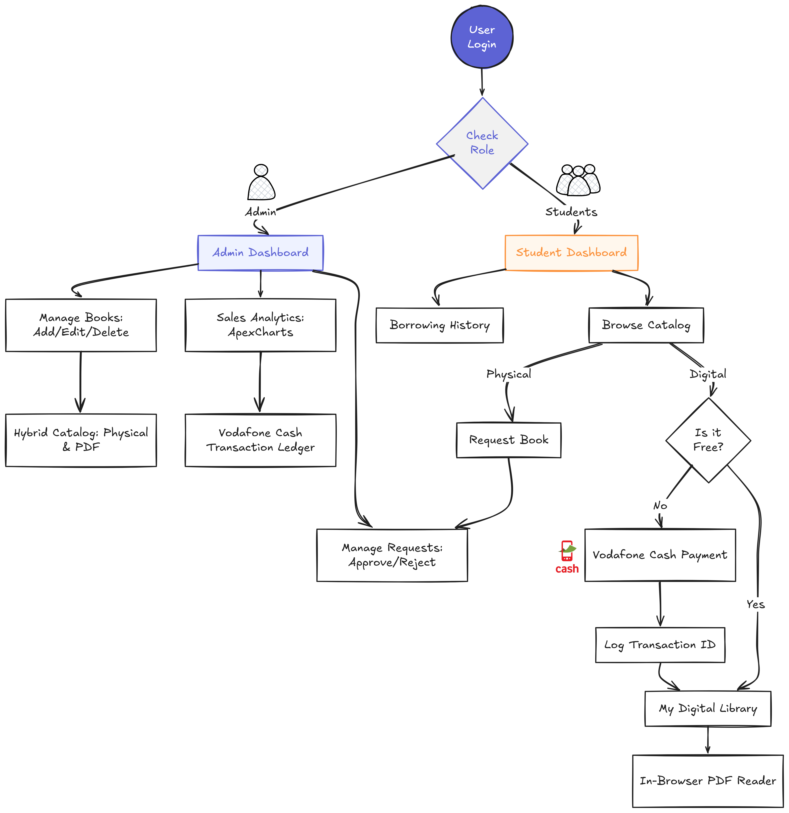
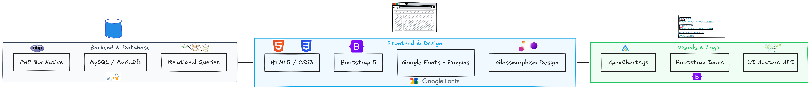
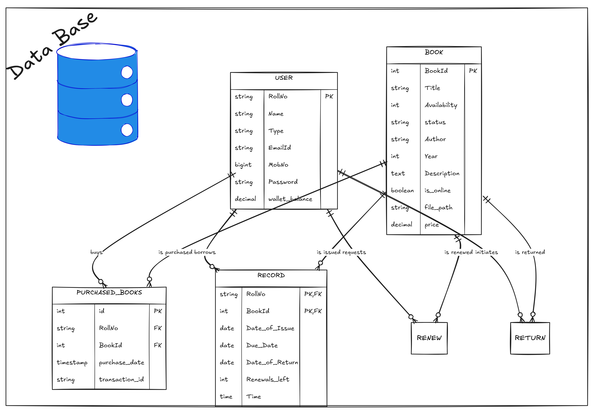

# 📚 Library Management System (LMS)

<p align="center">
  <b>A professional, hybrid Library Management System built with Native PHP, designed to manage both physical book circulation and digital e-book sales.</b>
</p>

---

## 🖼️ Preview
<p align="center">
  
</p>

---

## 📝 Overview
This system provides a seamless experience for both Librarians and Students:
- **Librarian Portal:** For inventory control, sales analytics, and request management.
- **Student Portal:** For browsing, borrowing physical books, and purchasing digital PDFs.

---

## 🔄 System Flow & Logic
<p align="center">
  
</p>

---

## 🛠️ Tech Stack & Tools
<p align="center">
  
</p>

---

## 🗄️ Database Structure (ER Diagram)
<p align="center">
  
</p>

---

## 📂 Project Structure
```text
/library 
│
├── /admin             # Librarian management portal
├── /student           # Student gateway & Digital library
├── /includes          # Centralized DB connection (dbconn.php)
├── /uploads           # Secure storage for digital PDFs
├── index.php          # Main Auth Gateway
└── lms.sql            # Database Schema
